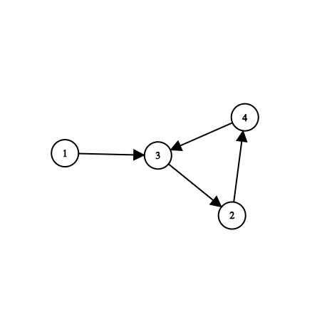
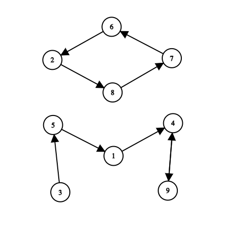

# Floyd Cycle Detection Algorithm to find duplicate numbers in an array

## Problem Statement

Given an array of integers containing `n + 1` integers, where each integer is in the range `[1, n]` inclusive. If there is only one duplicate number in the input array, this algorithm returns the duplicate number without modifying the original array, otherwise, it returns -1.

## Approach
- We can imagine the array `arr` as a directed graph where each element is a node. `arr[i]` is the index of the node to which the i-th node points.
- For example, given the `arr = [1, 3, 4, 2, 3]`, we can represent `arr` as the following <br></br>


- Since there are duplicates in `arr`, a cycle exists in the directed graph as there is a path from node 3 to itself, `3 -> 2 -> 4 -> 3`.
- The problem now becomes finding the entrance node to the cycle (3 in this case). 
- We can use the Floyd Cycle Detection Algorithm (also known as the "Hare and Tortoise algorithm") to detect the entrance of the cycle.
- The idea of the algorithm is to maintain two pointers, `hare` and `tortoise` that iterate the array at different "speeds" (just like the fable). The details are as follows:

### The procedure
- Using two pointers `hare` and `tortoise`.
- Initiate `hare = tortoise = arr[0]`.
- For every next step until `hare == tortoise` again, assign `hare = arr[arr[hare]]` and `tortoise = arr[tortoise]` (`hare` "jumps" 2 steps while `tortoise` "jumps" one step).
- At this point, `hare == tortoise`, reset `tortoise = arr[0]` while keeping the value of `hare` in the above procedure.
- For every next step until `hare == tortoise` again, assign `hare = arr[hare]` and `tortoise = arr[tortoise]` (this time `hare` only "jumps" one step).
- When `tortoise == hare`, the entrance of the cycle is found, hence `hare` and `tortoise` represent the value of the duplicated element.
- Return `tortoise` (also possible to return `hare`)
  
## Time Complexity

`O(n)`

## Space Complexity

`O(1)`, since we only use two extra variables as pointers.

## Example with step-by-step explanation


```
arr = [3, 4, 8, 5, 9, 1, 2, 6, 7, 4]

hare = tortoise = arr[0] = 3

1st step:
  - hare = arr[arr[3]] = arr[5] = 1
  - tortoise = arr[3] = 5
2nd step:
  - hare = arr[arr[1]] = arr[4] = 9
  - tortoise = arr[5] = 1
3rd step:
  - hare = arr[arr[9]] = arr[4] = 9
  - tortoise = arr[1] = 4
4th step:
  - hare = arr[arr[9]] = 9
  - tortoise = arr[4] = 9

tortoise = arr[0] = 3

1st step:
  - hare = arr[9] = 4
  - tortoise = arr[3] = 5
2nd step:
  - hare = arr[4] = 9
  - tortoise = arr[5] = 1
3rd step:
  - hare = arr[9] = 4
  - tortoise = arr[1] = 4

return tortoise = 4
```

#### Video Explanation

- [YouTube video explaining the Floyd Cycle Detection algorithm](https://www.youtube.com/watch?v=B6smdk7pZ14)
- [Another Youtube video](https://www.youtube.com/watch?v=PvrxZaH_eZ4&t=1s)
